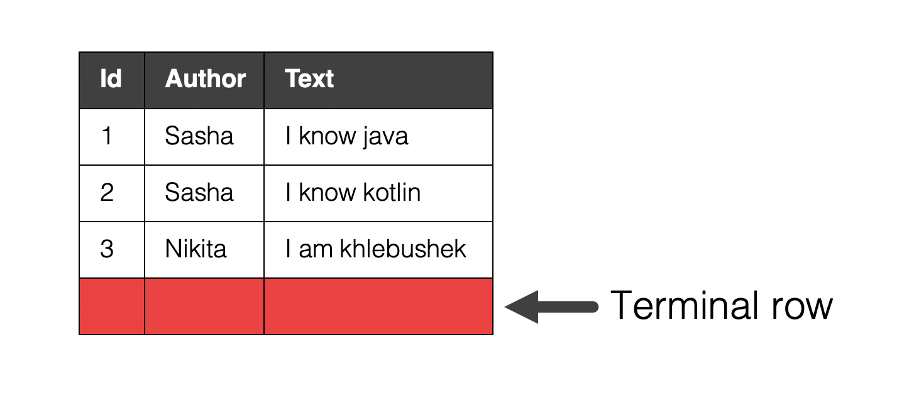

# Computational compGraph

## What it is?

## Main concepts

### Row

#### Terminal rows

### Operator

#### Map

#### Reduce

#### Join

### Node

### Graph

## Our project

## Your task

## Score

## Build and test
 